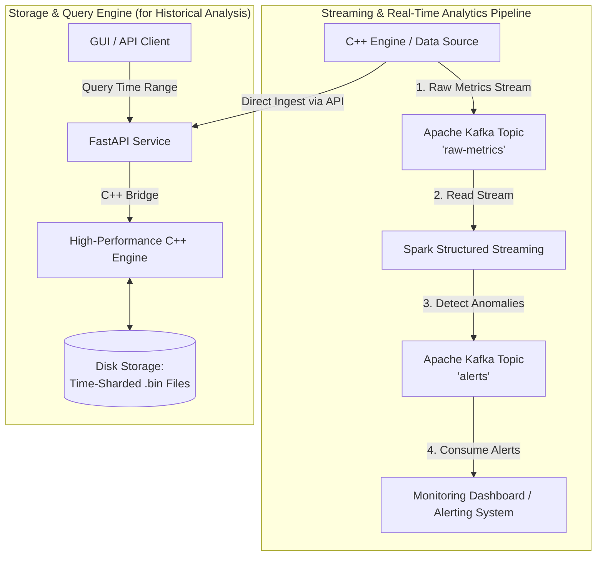

# C++ Time-Series Database & Streaming Analytics Platform (Insight-TSDB)

A high-performance time-series database engine built from scratch in C++, integrated with a **real-time streaming analytics pipeline using Apache Kafka and Apache Spark**. This project is a deep dive into both low-level systems programming and high-throughput data engineering.

The system is designed to:
1.  **Store** numerical time-series data with maximum efficiency using custom C++ compression.
2.  **Query** data with sub-millisecond latency for interactive analysis.
3.  **Monitor** the health of the data stream in real-time to detect anomalies and ensure data integrity.

## Key Features

- **Custom C++ Storage Engine**: Core logic is written in C++17 for direct memory control, achieving a **2.0x compression ratio** with custom Delta-of-Delta and XOR algorithms.
- **High-Performance Querying**: A time-sharded architecture enables **sub-16ms cold query latencies**, avoiding slow full-disk scans.
- **Real-Time Anomaly Detection**: A streaming pipeline uses **Apache Spark** to continuously analyze metrics from an **Apache Kafka** topic, detecting data integrity failures (e.g., compression ratio drops) in real-time.
- **High-Throughput Ingestion**: The Kafka pipeline is tuned for performance, capable of sustaining ingestion rates of over **250,000 messages/sec** on commodity hardware.
- **Modern API & Tooling**: The system is fully containerized with **Docker Compose**, built with **CMake**, and includes a Python/FastAPI service for RESTful access.

## System Architecture

The project is a hybrid architecture combining a high-performance C++ database with a scalable data engineering pipeline for real-time monitoring.

### Architecture Diagram




## Benchmark Analysis

### Performance Results

| Metric | Result | Analysis |
|--------|--------|----------|
| **Kafka Ingestion Throughput** | **~267,000 ops/sec** | Validates the scalability of the Kafka pipeline, achieved by using a parallel Python producer to bypass the GIL and saturate multiple cores. |
| Storage Efficiency | ~8.2 bytes/point | A 50% storage reduction via custom C++ compression on high-entropy data. |
| Cold Query Latency (p99) | ~12 ms | Querying a 24-hour window proves the time-sharded C++ design avoids slow full-disk scans for historical data analysis. |
| C++ Ingestion Throughput | ~4,000 points/sec | Baseline for single-point file I/O. Establishes the need for the high-throughput Kafka pipeline for large-scale ingestion. |

## Getting Started

### Prerequisites

- [Docker](https://www.docker.com/products/docker-desktop/) & Docker Compose
- Git
- Python 3.10+ & `venv`

### 1. Launch the Full Stack (Kafka, Spark)

Clone the repository and use Docker Compose to build and start all services in the background.

```bash
git clone https://github.com/KaranSinghDev/Time-Series-Database-Engine.git
cd Time-Series-Database-Engine
docker-compose up -d
```
- **To view the Spark UI:** Open your browser to `http://localhost:8080`.

### 2. Run the Real-Time Anomaly Detection Demo

This demonstrates the end-to-end streaming pipeline. **Open three separate terminals.**

```bash
# Terminal 1: Start the Alert Consumer
python alert_consumer.py

# Terminal 2: Start the Data Producer
python producer.py

# Terminal 3: Submit the Spark Streaming Job
docker exec -it tsdb-spark-master /opt/spark/bin/spark-submit \
  --packages org.apache.spark:spark-sql-kafka-0-10_2.12:3.5.1 \
  /app/stream_processor.py
```
You will now see alerts appear in Terminal 1 whenever the producer in Terminal 2 simulates a compression failure.

### 3. Run the Comprehensive Benchmark Utility

This single script allows you to test both the C++ engine and the Kafka pipeline.

```bash
# In a new terminal, with the venv activated
python benchmark.py
```
You will be presented with an interactive menu to choose which benchmark to run.

## Local Development & C++ Testing

To work on the C++ engine directly, you'll need a C++17 compiler and CMake.

### 1. Build the C++ Engine

```bash
cd engine
cmake -B build
cmake --build build
```

### 2. Run C++ Unit Tests
```bash
# From the 'engine' directory
./build/engine_test
```
